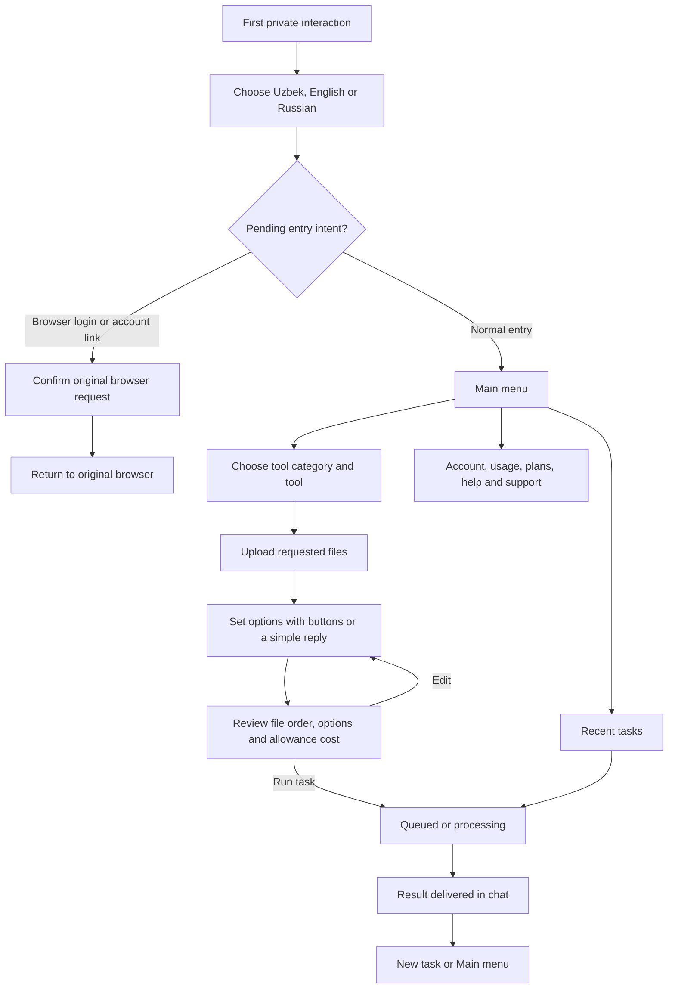

# PDF Master Telegram experience

Updated 24 September 2026. This is the product flow and acceptance contract for the guided Telegram interface. The underlying account, quotes, processing, allowances and delivery services remain shared with the web application.

## Research translated into design decisions

Telegram recommends making `/start` useful and using buttons for the main journey instead of requiring parameterized commands. PDF Master therefore uses a small home menu, inline choices and contextual text prompts; commands remain shortcuts. [Telegram Bot Guidelines](https://core.telegram.org/bots/guidelines)

Inline keyboards suit navigation and settings. Telegram also supports localized command menus, global `/start`, `/help` and `/settings` commands, and start parameters for entry from another application. We use those capabilities while making the user's explicit language choice persistent. [Telegram Bot Features](https://core.telegram.org/bots/features)

Every callback is acknowledged before slower work; Telegram otherwise leaves the button's progress indicator active. Callback data is an opaque, short reference to server-side state. Buttons never carry account secrets or editable authorization claims. [Telegram Bot API: CallbackQuery](https://core.telegram.org/bots/api#callbackquery), [InlineKeyboardButton](https://core.telegram.org/bots/api#inlinekeyboardbutton)

The screens and copy below are PDF Master's design decisions, not claims that Telegram prescribes this exact flow.

## First contact and identity

The first normal interaction shows only a language choice, even if Telegram supplies a language code. The user may choose **O‘zbekcha**, **English** or **Русский**. The question itself appears in all three languages so it is understandable before a preference exists. A returning user goes directly to the localized main menu; **Change language** remains available there, in account settings and through `/language`.

The preference belongs to the Telegram conversation until identity resolution is safe. Choosing a language must not create a second account when a person arrives to link Telegram to an existing Google/email account.

| Entry | After choosing a language |
| --- | --- |
| `/start` or ordinary message | Open Home. |
| First file or photo | Explain that it was not imported and ask the user to send it again; do not silently pretend it was stored. |
| Browser sign-in deep link | Resume the original sign-in request and ask for confirmation. |
| Account-link deep link | Show the original browser context and ask for explicit linking confirmation. Finish only in the initiating browser. |
| Referral deep link | Preserve the referral until the person has selected a language, then apply normal eligibility rules. |
| Group/channel message | Explain that documents and account actions belong in a private conversation; provide the bot's private-chat link when configured. Do not resolve an account or download files. |

A malformed, expired or already-used login request has a clear recovery message. Language selection never approves a login. A confirmation from another Telegram sender is rejected. Existing account-link conflict checks remain in force.

## Main menu and navigation

The main menu introduces the next action in one short paragraph. It includes these destinations without listing every file tool at once:

- **PDF tools**: merge, compress, split, extract, delete, reorder and rotate pages.
- **Convert files**: images to PDF, PDF to images, Word to PDF and PowerPoint to PDF.
- **Recent tasks**: submitted tasks, status and available results.
- **My account**: current allowances, reset time, plans/subscription, and sign-in settings for email, Google and Telegram identities.
- **Help & support**: examples, support message entry and payment help.
- **Change language** and **Open workspace**.
- **Continue current task** when an unfinished draft exists.

Back returns to the relevant previous screen. **Main menu** leaves an unfinished draft available to resume. **Cancel task** asks **Yes, cancel draft** before discarding its inputs/settings, without claiming a submitted job was cancelled. **New task** asks **Start fresh** before replacing the current draft. No routine option requires JSON.

## File-tool journey

1. **Choose a tool.** Group related tools; paginate long groups. Show a localized tool name, accepted file type, whether multiple inputs are required, and one next action.
2. **Upload.** Confirm the file name and page count. The selected tool survives the upload. A compatible file sent from Home opens a useful task flow; an incompatible file is explained before processing. Photos can be used for image-to-PDF; recommend sending as a file when original quality matters.
3. **Configure.** Use choices for rotation, image format, resolution, paper and orientation. For page ranges, file order, margins and support text, ask one question with a concrete example and accept a plain reply. The prompt survives a bot process restart.
4. **Review.** Show ordered file names, readable settings, task/page allowance cost, remaining allowance, and quote expiry. The primary action is **Run task**; offer edit and cancel beside it. Uploading another file after review requires an explicit add-to-current/new-task choice.
5. **Run.** Acknowledge the click promptly. Submit one job using the immutable quote and an idempotency key; retries must not repeat charging. Display queued/running state with **Check status** and **Recent tasks**. Production processing belongs to the worker rather than blocking the bot's event loop. A failed task offers **Review and try again**, which clears the old quote and returns to settings; a new review and explicit Run are required before another job is created.
6. **Result.** Deliver the actual output file, or direct the user to the authenticated web workspace if Telegram cannot accept its size. Show a next action and retention information. Compression without useful savings says so and does not claim a new result or allowance charge.

Tool examples:

| Tool | Guided option entry |
| --- | --- |
| Merge PDFs / images to PDF | Upload in order; change order with a reply such as `2,1,3`; remove an input by its displayed position. |
| Split PDF | Choose one file per page or enter groups such as `1-2;3-5`. |
| Extract / delete / rotate / export pages | Enter `1,3-5`, or choose all pages where appropriate. |
| Reorder PDF pages | Enter every page once in the desired order, such as `3,1,2`. |
| Rotate pages | Choose 90°, 180° or 270°, then optionally select pages. |
| PDF to images | Choose PNG/JPG and resolution. |
| Images to PDF | Choose paper, orientation and a numeric margin. |
| Password-protected operations | Open the secure web workspace; never ask for document passwords in the chat. |

## Copy and locale rules

Translate prompts, buttons, status names, usage labels and recovery actions together. User file names and user-written support messages keep their original text. Short functional labels are preferable to emoji-only buttons. Values such as dates, file counts and task status must be readable rather than raw JSON or internal feature identifiers.

| Meaning | English | O‘zbekcha | Русский |
| --- | --- | --- | --- |
| Entry question | Choose your language | Tilni tanlang | Выберите язык |
| Main menu | Main menu | Bosh menyu | Главное меню |
| PDF tool selection | PDF tools | PDF vositalari | Инструменты PDF |
| Conversion tools | Convert files | Faylni o‘girish | Конвертация |
| History | Recent tasks | So‘nggi vazifalar | Последние задачи |
| Next step | Review quote | Hisob-kitobni ko‘rish | Проверить расчёт |
| Confirm processing | Run task | Vazifani bajarish | Выполнить |
| Recovery | Send the file again | Faylni qayta yuboring | Отправьте файл ещё раз |
| Reset draft | New task | Yangi vazifa | Новая задача |
| Exit step | Cancel | Bekor qilish | Отмена |

Button wording may be shortened to fit Telegram clients, while retaining the same meaning. Existing command aliases remain available to experienced users, but the visible journey does not depend on knowing them.

## Secondary journeys

**Recent tasks:** list recent task names, localized status and creation time. Users can inspect progress, recover a ready result with **Send result again**, or start again after expired input/output. Returning to history does not resubmit a job.

**Usage and plans:** show file tasks, page units and AI credits with reset information. Offer the existing plan/purchase interface. Payments continue to use the verified provider flow; support does not imply payment success.

**Account:** explain that the same account is shared with the web app. Open account settings to add Google/email sign-in. Linking an existing web account must begin from that authenticated account's settings and finish in the initiating browser.

**Help & support:** explain the happy path in a few sentences and offer **Contact support**, **Payment help**, **Open workspace** and **Main menu**. Result messages explain that files on the server expire after 24 hours and delivered Telegram files remain in chat.

**Support:** a button starts a plain-message prompt. Show the proposed message and require **Send request**, with **Edit message** and **Main menu** alternatives. Preserve payment/general category. Only confirmation creates the ticket; return its reference and main menu. Repeated confirmation does not create duplicate tickets. Cancel exits without creating a ticket.

## Recovery and operational contract

| Situation | Required behavior |
| --- | --- |
| Invalid range/order/margin | Explain the expected format; keep both the files and active prompt for correction. |
| Unsupported or oversized upload | Explain the accepted type/limit and offer the web workspace or a different tool. No job or charge. |
| Stale or foreign callback | Acknowledge, reject mutation, and provide a fresh navigation path. Never fall through to another user's data. |
| Repeated Run | Return the existing task/delivery state; one job and one consumption entry. |
| Bot restarts during text entry | Read persisted conversation/prompt state and accept the user's reply. |
| Worker is busy | Report queued/running accurately; let the user navigate elsewhere while durable delivery continues. |
| Worker fails or finds no useful change | Deliver a localized terminal notice once, with Recent tasks/Main menu actions. Do not leave the user waiting for a file that will never arrive; retry requires a fresh review. |
| File or quote expires | Request a new upload or review as appropriate; never reuse unavailable data or charge for rejected processing. |
| Telegram throttles delivery | Retry with Telegram's suggested delay. Do not reprocess the document. |
| User blocked the bot | Mark delivery blocked; retain task state for the web app. |
| User changes language | Update future bot screens and shared account preference without modifying task inputs/options. |

## Verification plan

Automated dispatcher tests use real aiogram updates and an offline transport, with real account/draft/quote services and real small PDF fixtures. They cover actual user-visible journeys rather than asserting implementation text or source layout:

- First private contact offers all three languages and does not process files before selection.
- A chosen language persists across new dispatcher instances, including guided plain-text prompts.
- A browser account-link deep link survives onboarding without creating an extra customer or approving the challenge automatically.
- An ordinary user completes a small PDF task through buttons and a plain-text option reply, then receives the correct PDF output.
- Invalid options recover without losing a valid draft; stale buttons and another sender cannot mutate it.
- Run callback acknowledgment precedes processing; replay produces one job and one charge.
- Home, help, usage, account, support and cancel have useful navigation and no unintended side effects.
- Long file names and option summaries remain valid Telegram HTML within its visible-text limit; display shortening never mutates the underlying options.
- Download timeouts and misleading extensions recover without attaching the wrong file to the current draft.
- Private documents cannot be processed from group messages; first-contact upload is explicitly recoverable.
- Existing quote, transport replay, payment, account-link and durable delivery tests remain green.

Before release, verify localized command installation and configured polling/webhook operation. Use only a dedicated test account for any live bot round trip; do not send messages to unrelated users. Verify both existing server projects remain isolated when deploying the platform change.
